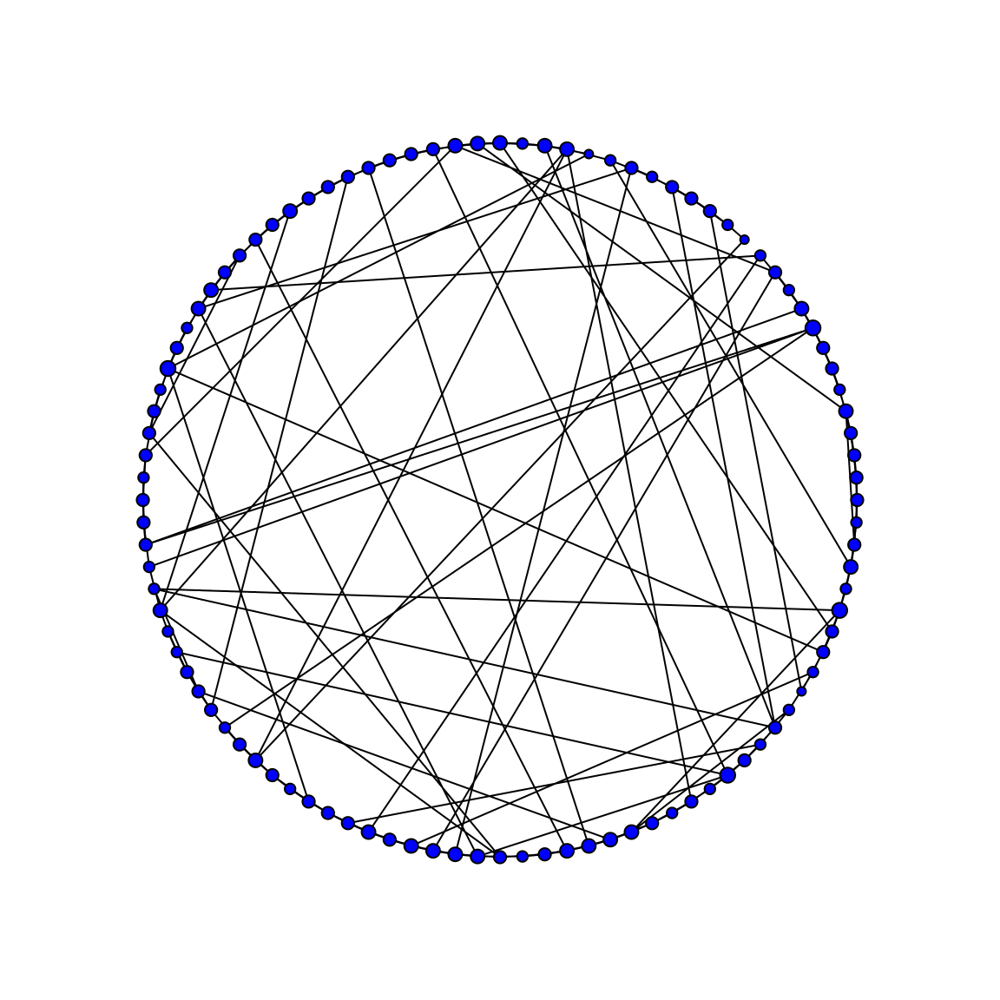
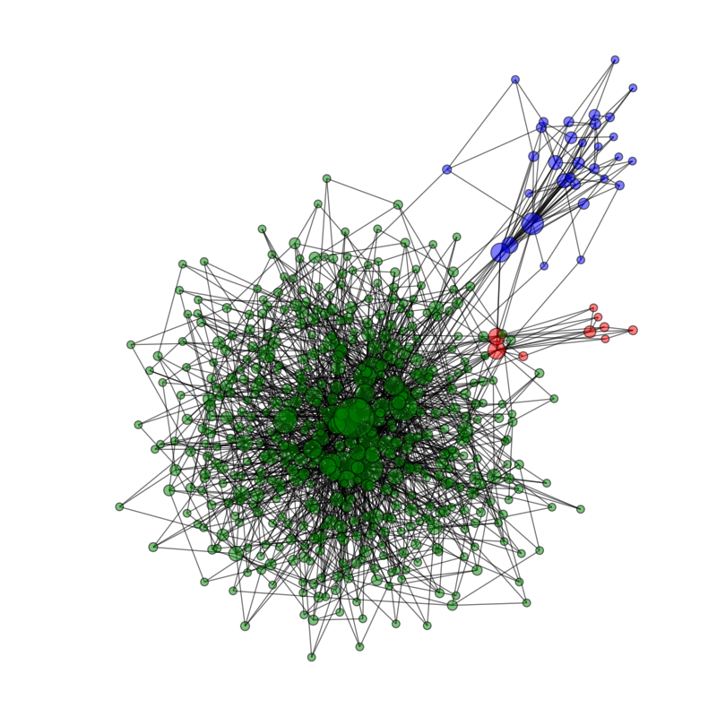

.. _background:

********************
Background
********************

.. currentmodule:: HIVABM

=================
Population
=================
Our system is modeled as a collection of autonomous decision-making
agents embedded in space and time. We assign each agent with the
following characteristics (and the associated possible values): 

* Drug user type (IDU, NIDU, ND)
* Sex type (MSM, HM, WSW, HF) 
* HIV status (0,1)
* Aids status (0,1)

After initializing the population size, which is an input parameter in
our model, these characteristics are assigned randomly to each
agent. The given data allow us to estimate the distribution of these
characteristics in the population. In particular, for each agent we
assign the value for each internal exposure as follows: First,
we define each agent's drug user type. Second, we chose a random sex
behavior for the agent based on the drug usage classification. Third,
we specify the agent's HIV and AIDS status based on the agent's
drug and sex behavior. 

=================
MSA
=================
To come...

=================
Social Network
=================

Agents interact with each other through a static social network that
is undirected, i.e., if person A is connected to B, B is connected to
A, with unweighted links, i.e., each connection is of the same
importance. Different algorithms have bee propoese to model social
networks, e.g., the small-world model by Watts and Strogatz (1998) and
the scale-free network model developed by Barabasi and Albert (1999),
which is based on preferential attachment. 

In the Watts and Strogatz model all agents start with the same number
of connections to their nearest neighbors (4 in the drawn
example). The  small-world property is introduced by rewiring links
randomly  in the circular layout (in the shown example with a
propability of  p=0.2). That way the average path length (which is the
average number of steps needed to connect any two nodes) is strongly
reduced. The idea of six degree of separation (everybody knows every
other human through 6 other people on average) is the empirical
evidence for that model. However, this network model has an
homogeneous node degree distribution.  

   Example of a small world network.

The node-degree distribution of a scale-free network follows a
power-law. This is a characteristic found in many networks including
social networks. It means that most of the nodes are connected to very
few nodes only. Some nodes however have a very high node degree, i.e.,
in our case some agents are connected to a lot of other agents. It has
been shown that these highly connected agents play an important role
for diffusion processes on the network.
 
.. figure:: _static/ScaleFree.png
   :scale: 30 %
   :align: center

   Example of a scale free network.

.. figure:: _static/ScaleFree_NodeDegreeDistribution.png
   :scale: 40 %
   :align: center

   Node degree distribution for a scale free network.

Both models should not be viewed as fully realistic. However, both
models capture different characteristics that determine the behavior
of the process on the network. Thus the choice of the underlying
network model influences the outcome of the agent based model.

However, none of these models account for assortative
mixing. Therefore a new model was developed. Our model applies biased
preferential attachment and is based on the work by Ba abasi and Albert.

The Barabasi Albert model starts with a seed network of few nodes. New
nodes are added to the network one at a time whereas each new one is
connected to m = 3 existing nodes with a probability that is
proportional to the number  of links that the existing nodes already
have. Hence new nodes have a preference to attach to heavily linked
nodes. Because of this preference and because the model grows, it is
called a preferential growth model. The Barabasi Albert model is one
of several proposed models that generates scale-free networks, i.e.,
its node-degree distribution follows a power law, and is widely used
to generate random networks.

To account for the bias of agents to connect to agents that have
similar (or dissimilar) characteristics we include an additional
bias. This is one important way in which social networks differ from
other type of networks. Assortative mixing arises, e.g., in a
population where males (mostly) couple with females (strong bias towards
dissimilar agents). Another example is the bias of social connections
of agents towards agents that share the same socioeconomic background,
which is an important fact in our model. 

We implement assortative mixing by introducing an additional bias in
the above described preferential attachment model. Each incoming new
node is not only connected proportional to the number of links that
the existing nodes already have, but also has a higher likelihood to
connect to nodes/agents which share the same characteristics.

In particular, before the new incoming node is added to the network,
with a 5% chance we connect the new node proportional to the number
of links that all existing nodes already have, i.e., the follow the Albert-Barabasi
updating step described above. With a likelihood of 95% we let the new
node connect only to nodes which present agents with the same
drug usage behavior, again proportional to the number of links the existing
nodes (with same ethnicity) already have.

The probabilities are parameters of our
model and can easily be changed and adjusted according to
the model intentions. Our idea can easily be expanded to include more
characteristics to account for in the attachment step. The resulting
social random network is scale free and exhibits assortative mixing
and is a therefore captures more charactersitics of real world social
networks than the original Albert-Barabasi model, for example.

   Example assortative graph. *ND* agents are represented by green
   nodes, *IDU* and *NIDU* agents with red and blue ones respectively.

If we change the likelihood with which incoming nodes attach to
similar nodes to a smaller values, the resulting network is more
homogeneously mixed.

=================
Update rules
=================

The individual behavior of an agent depends on its internal and
external exposures and follows simple rules. 

Agents are connected with other agents through a static social
network. At each time step, every agent meets one random agent s/he
is connected to, i.e., each agent initiates an interaction.  Sweeping
through all agents will cause some agents to meet twice within one
time step and some agents will even make several contacts. The number
of contacts within one time step is proportional to the agents number
of connections. 

At each time step, we parse through the whole population and update
the agents status according to predefined rules. First, ...
