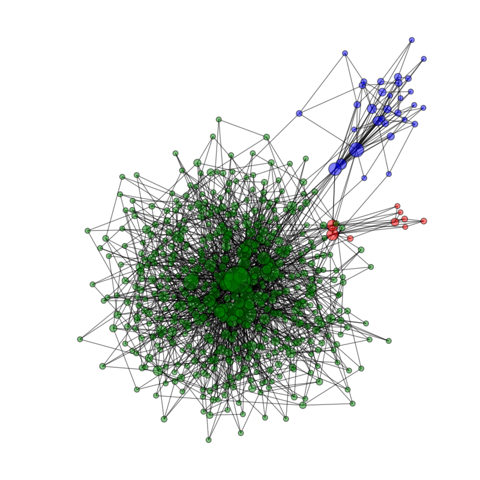
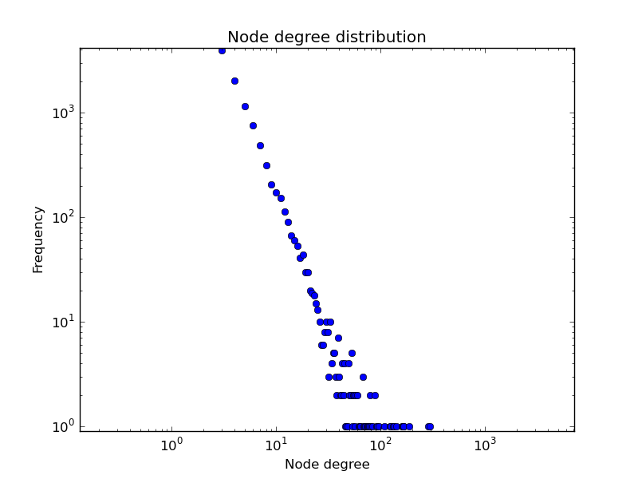

.. _getting_started:

***************
Tutorial
***************

.. _prerequisites:

Prerequisites
=============================

You may already have `NumPy <http://docs.scipy.org>`__
installed -- you can check by doing::

 python -c 'import numpy'

Also check for `Matplotlib <http://matplotlib.sourceforge.net/>`__
and `NetworkX <http://networkx.lanl.gov/>`__::

 python -c 'import matplotlib'
 python -c 'import networkx'

We recommend the `Enthought Python Distribution (EPD)
<http://www.enthought.com/products/epd.php>`__ , which is free for
academic use. It contains many useful scientific programming libraries
that are preconfigured for maximum compability.

.. _PopulationClassTutorial:

Population Class
=============================

.. py:currentmodule:: HIVABM_Population

Move to the directory where the files
:file:`HIVABM_Population.py`, :file:`HIVABM_Network.py`, and
:file:`HIVABM_Evolution.py` are stored. 

Each module is callable, i.e., we can call
:file:`HIVABM_Population.py` directly from the shell. When the module is called it is tested
with explicitly written test functions. If all tests pass
succesfully it should look like this::

    python HIVABM_Population.py
     ... Testing the population
     .
     ----------------------------------------------------------------------
     Ran 1 test in 1.719s

     OK

To understand the :class:`PopulationClass` class better we can start a
python session and work interactively, e.g., by typing::

    ipython

Let's import the population::

     >>> import HIVABM_Population

and initialize an instance of the :class:`PopulationClass`::

     >>> myPopulation = HIVABM_Population.PopulationClass(n = 100000)

We have just created a model population with the name
**myPopulation**. Let's have a look at some
characteristics of the population. 

We can get some information about our population and print it::

    >>>  myPopulation.print_info()
    Number of agents 100000
    Number of IDU 1910
    Number of NIDU 6469
    Number of ND 91621
    >>> myPopulation.get_info_DrugUserType()
      {'Number of IDU agents': 1910,
       'Number of ND agents': 91621,
       'Number of NIDU agents': 6469}
    >>> myPopulation.get_info_HIV_IDU()
      {'Number of HIV HF': 115,
       'Number of HIV HM': 206,
       'Number of HIV MSM': 42,
       'Number of HIV WSW': 20}
    >>> myPopulation.get_info_DrugSexType()
     {'Number of HF': 47149,
      'Number of HF IDU': 514,
      'Number of HF ND': 44256,
      'Number of HF NIDU': 2379,
      'Number of HM': 46909,
      'Number of HM IDU': 1181,
      'Number of HM ND': 42027,
      'Number of HM NIDU': 3701,
      'Number of MSM': 2278,
      'Number of MSM IDU': 119,
      'Number of MSM ND': 1946,
      'Number of MSM NIDU': 213,
      'Number of WSW': 3664,
      'Number of WSW IDU': 96,
      'Number of WSW ND': 3392,
      'Number of WSW NIDU': 176}

First note how all three methods are attributes of our population instance
:class:`myPopulation`. Also note that the information are returned in
form of a dictionary.

We can return all agents and their characteristics (dictionary) and have a look at
the first agent explicitly::

    >>>  AgentsDict =  myPopulation.get_agents()
    >>>  type(AgentsDict)
    <type 'dict'>
    >>>  len(AgentsDict)
    100000
    >>> AgentsDict[1]
    {'AIDS': 0, 'Sex Type': 'HF', 'HIV': 0, 'Drug Type': 'ND'}

.. _NetworkClassTutorial:

Network Class
=============================

.. py:currentmodule:: HIVABM_Network

Move to the directory where the files
:file:`HIVABM_Population.py`, :file:`HIVABM_Network.py`, and
:file:`HIVABM_Evolution.py` are stored. 

As before, we can first test the module through calling it directly. If all the tests pass
succesfully it should look like this::

    python HIVABM_Network.py
     ... Testing the network initialization
     . ... Testing the method _set_pool
     . ... Testing the method _update_pool
     .
     ----------------------------------------------------------------------
     Ran 3 tests in 0.324s

     OK

To understand the :class:`SocialNetworkClass` class better we can start a
python session and work interactively, e.g., by typing::

    python

Let's import the population::

     >>> import HIVABM_Network

and initialize an instance of the :class:`SocialNetworkClass` class::

     >>> myNetwork = HIVABM_Network.SocialNetworkClass(N = 500)

Note that we chose a much smaller population size because we want to
illustrate the graph later on.

The class :class:`SocialNetworkClass` inherits all methods and
attributes from the :class:`HIVABM_Population.PopulationClass` class. In fact, when we
initialized the social network, we also intialized a population, which
makes sense because we need the population for a social network. We
can see that methods from :class:`HIVABM_Population.PopulationClass` are inherited::

    >>> myNetwork.print_info()
    Number of agents 500
    Number of IDU 9
    Number of NIDU 32
    Number of ND 459
    >>> myNetwork.get_info_DrugUserType()
     {'Number of IDU agents': 9,
      'Number of ND agents': 459,
      'Number of NIDU agents': 32}

We have intiated our network instance named **myNetwork** and have
created the social network. This was done automatically during the
initiation by calling the method :meth:`SocialNetworkClass._set_assortative_graph`. 

Let's have a closer look at our social network. The social network is
a networkX object:: 

    >>> G = myNetwork.get_assortative_graph()
    >>> type(G)
    <class 'networkx.classes.graph.Graph'>

We can visualize the network::

    >>> myNetwork.visualize_network(G)
    Plotting...
    
and should get a figure that looks similar to the follwing
illustration.

There might be a weird looking warning message. But as long as we see
a figure I think it's fine.

We can also plot the node degree distribution. In oder to get a better
approximation of the distribution we create a bigger network::

    >>> myBigNetwork = HIVABM_Network.SocialNetworkClass(N = 10000)
    >>> BigG = myBigNetwork.get_assortative_graph()
    >>> myBigNetwork.plot_DegreeDistribution(BigG)

The figure illustrates that our model network is scale free, i.e.,
that the node degree distribution follows a power law.

.. _ModelClassTutorial:

Model Class
=============================

.. py:currentmodule:: HIVABM_Evolution

This is the module that define the actual update rules.

Move to the directory where the files
:file:`HIVABM_Population.py`, :file:`HIVABM_Network.py`, and
:file:`HIVABM_Evolution.py` are stored. 

As before, we can first test the module through calling it directly. If all the tests pass
succesfully it should look like this::

    >>> python HIVABM_Evolution.py
     ... Test: method _NeedleTransmission
     . ... Test: method _SexTransmission
     . ... Test: method _update_population
     .
     ----------------------------------------------------------------------
     Ran 3 tests in 0.122s

     OK

To understand the :class:`HIVModel` class better we can start a
python session and work interactively, e.g., by typing::

    python

Let's import the population::

     >>> import HIVABM_Evolution

and initialize an instance of the :class:`SocialNetworkClass` class::

     >>> myModel = HIVABM_Evolution.HIVModel(N = 10000)

The class :class:`HIVModel` inherits all methods and
attributes from the :class:`SocialNetworkClass` class and therefore
also the ones from :class:`PopulationClass`. We can  illustrate the
inheritance with the following example::

    >>> myModel.print_info()    # method defined in PopulationClass
    Number of agents 10000
    Number of IDU 191
    Number of NIDU 646
    Number of ND 9163
    >>> G = myModel.get_assortative_graph()
    >>> myModel.plot_DegreeDistribution(G)

We can run a simulation of our model::

    >>> myModel.run()

and visualize the results:

    >>> myModel.plot_results()

